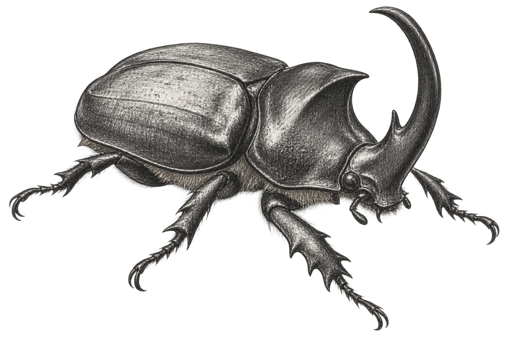

# NOMENCLATURE ENTRY 3

## The First Specimen Is “Common.”

**Discipline observed:** Biological classification  
**Naming system examined:** Common names  
**Initial assumption:** *Common* identifies a meaningful biological property  
**Revised finding:** Frequently, it identifies the species humans named before realizing they would need more names

Humans use the word **common** to identify an extraordinary number of living things.

There is a common raven.

There is a common dolphin.

There is a common starling.

There is a common octopus.

There is a common wombat.

There is even a common human understanding of what *common* is supposed to mean, although this understanding becomes unstable immediately after examination.

The designation may indicate that a species is widespread.

It may indicate that the species is frequently encountered within the region occupied by the humans who named it.

It may distinguish the familiar specimen from a related specimen discovered later.

It may also mean that somebody assigned the name before realizing how many similar organisms remained unclassified.

This produces an important principle of human nomenclature:

**The first specimen receives a name.**

**Every subsequent specimen receives an explanation.**

### The Adjectival Debt

Suppose humans encounter an animal.

They call it a woodpecker.

Later, they encounter another woodpecker.

The original animal is already occupying the available name.

The second must therefore become the **lesser** woodpecker, the **greater** woodpecker, the **red-headed** woodpecker, the **downy** woodpecker, or the **something-that-distinguishes-it-from-the-one-we-named-first** woodpecker.

The precise adjective varies.

The burden does not.

The first specimen enters human language without qualification. It becomes the reference point against which every later relative must identify itself.

This is taxonomic seniority.

The first organism did not request it.

The later organisms cannot appeal.

Over time, the system accumulates an **adjectival debt**.

There are lesser specimens and greater specimens.

There are eastern and western specimens.

There are northern, southern, long-tailed, short-tailed, red-bellied, white-faced, broad-footed, narrow-headed, spotted, striped, false, true, pygmy, and giant specimens.

A name that began as a simple act of recognition expands into a compressed description of everything required to prevent confusion with the names already taken.

The second animal must explain itself before the human will acknowledge that it exists.

The first animal is simply *the animal.*

### Common to Whom

The word *common* also contains a location.

The humans rarely include this location in the word.

An organism may be common within one forest, coastline, country, continent, or historical period and entirely absent from another. A human reading the name from elsewhere may reasonably conclude that the organism is common in some larger or more universal sense.

It is not.

It was common to the people who named it.

The name preserves their position.

A common species is therefore not merely a biological population. It is a record of repeated contact between that population and a particular group of humans.

The humans saw it often enough that it became ordinary.

They built their own familiarity into the animal’s identity.

This is another form of emotional residue, although the emotion is quieter than fear or wonder.

It is recognition.

*We know this one.*

*This one lives near us.*

*This is the one we mean when no further explanation is provided.*

The word *common* is a small claim of intimacy disguised as objective classification.

### Greater and Lesser

The terms **greater** and **lesser** create an additional problem.

They appear to establish rank.

A greater organism sounds more accomplished than a lesser organism.

This is not necessarily the intended meaning. The distinction may refer only to size or another comparative feature.

The organism has nevertheless entered history as the lesser version.

It may possess unusual intelligence, superior coloration, an essential ecological role, and exemplary personal conduct.

It remains lesser.

The greater specimen may be marginally larger.

This has been judged sufficient.

Humans insist that the terminology contains no moral evaluation.

This is difficult to reconcile with their general use of the words *greater* and *lesser.*

The animals have not commented.

Their restraint is admirable.

### False and True

Human naming becomes more revealing when an organism resembles something already named.

If it resembles the original closely enough, it may become a **false** version of that organism.

Elsewhere, another specimen may be declared the **true** version.

The false organism has not committed fraud.

It did not knowingly imitate the other species.

It did not present falsified documentation.

The humans noticed a resemblance, made an incorrect assumption, corrected the assumption, and left the accusation inside the name.

This is efficient.

The entire history of the mistake remains available.

It is less clear why the animal must continue carrying it.

### The First Specimen Problem

The “common” specimen is not necessarily the most numerous, representative, or structurally fundamental.

It is frequently the one the humans named before realizing they would later require additional names.

The second specimen must therefore carry the entire burden of clarification.

This is how one animal becomes *the owl* and another becomes *the lesser mottled eastern marsh owl.*

The second animal did nothing to deserve this.

Human taxonomic systems attempt to correct such problems through formal scientific names. These are constructed according to more disciplined conventions and allow each organism to occupy a defined position within a larger biological structure.

This has not eliminated common names.

Humans require names they can remember, pronounce, argue about, teach to children, place on signs, and shout quickly when an organism enters the house.

Formal precision and practical language therefore coexist.

A species may possess one technically organized designation and several regional names, each preserving a different human encounter.

The scientists classify the organism.

Everyone else continues calling it whatever their grandparents called it.

### Australia

The adjective *common* ordinarily indicates that a specimen is widespread, familiar, or insufficiently distinctive to receive a more elaborate designation.

This should make the object sound less alarming.

Australia contains the **common death adder.**

The reassurance has not functioned.

Apparently, the humans encountered multiple death adders and determined that one represented the ordinary version.

This suggests the existence of specialized death adders.

I did not request the list.

Australian animal names display an unusual commitment to operational clarity.

The red-bellied black snake is black and has a red belly.

The eastern brown snake is brown and found in the east.

The saltwater crocodile is a crocodile frequently encountered in saltwater.

The common death adder is the death adder the humans apparently expect to encounter most routinely.

At some point, taxonomic creativity was judged less important than communicating the nature and approximate location of the emergency.

This is understandable.

A name shouted while backing away from an animal has different functional requirements than a name entered into a scientific archive.

The Australian system accounts for both.

### Endless Forms

The shortcomings of human naming become more understandable when the scale of the task is considered.

Terra contains more living variation than any ordinary vocabulary can represent cleanly.

Every forest contains distinctions.

Every coastline produces qualifications.

Every new examination separates one apparent species into several, reunites others, relocates entire branches, and leaves the common names standing nearby with the historical evidence.

The names become crowded because life is abundant.

The adjectives multiply because the forms do.

Charles Darwin concluded one of humanity’s foundational works on evolution with the following observation:

> “...whilst this planet has gone cycling on according to the fixed law of gravity, from so simple a beginning endless forms most beautiful and most wonderful have been, and are being, evolved.”

This sentence has been retained in my notes.

Beneath it, I have drawn one of the planet’s rhinoceros beetles.

The beetle is not a rhinoceros.

This matter will be addressed separately.

For the present observation, it is enough to note the horn, the armored body, the articulated legs, the improbable specialization, and the human need to place all of it somewhere inside language.

The name is inadequate.

The animal is not.

### Field Note

I initially interpreted human common names as evidence of disorganized classification.

They are evidence of this.

They are also evidence of abundance exceeding the original filing system.

Humans name what they encounter using the distinctions available at that moment. Then life presents another variation.

The humans add an adjective.

Life presents another.

The humans add two adjectives and a geographic direction.

The system is never finished because the living world is not finished presenting distinctions.

The names accumulate like annotations around something that refuses to become simple.

### Final Observation

Humans call one organism *common* not because it lacks value, but because it became familiar enough to serve as a beginning.

It is the species against which later discoveries are compared.

Its name records proximity.

Its relatives record the expanding edge of human attention.

The resulting terminology is uneven, historically burdened, and occasionally unfair to animals described as lesser, false, or insufficiently western.

It is also a map of discovery.

The humans began by naming one specimen *common.*

This caused difficulties when additional specimens were discovered.

Australia then produced a common death adder.

The naming system had ceased attempting to comfort anyone.

---

**GENERAL RULE:**

The first thing humans name receives a noun.

Everything discovered afterward receives an adjective.

---

**CLASSIFICATION:**

*Taxonomic Development → Discovery Order → Adjectival Burden*
